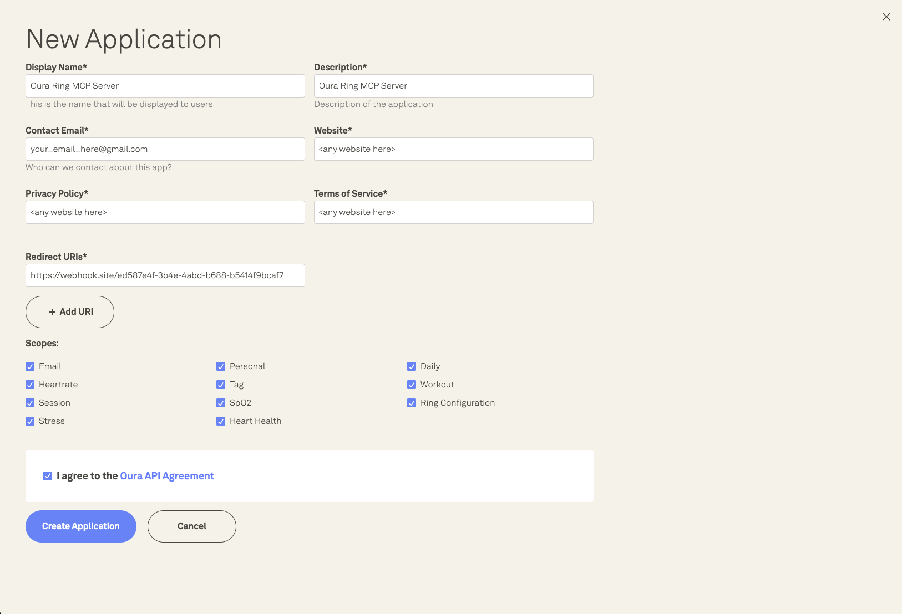
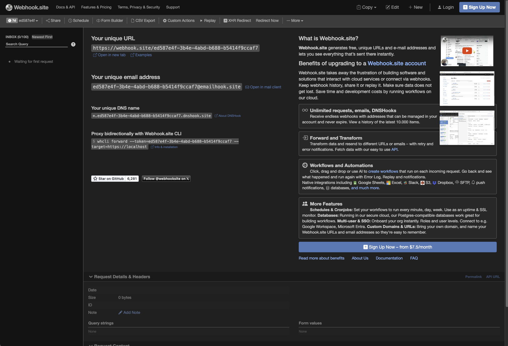
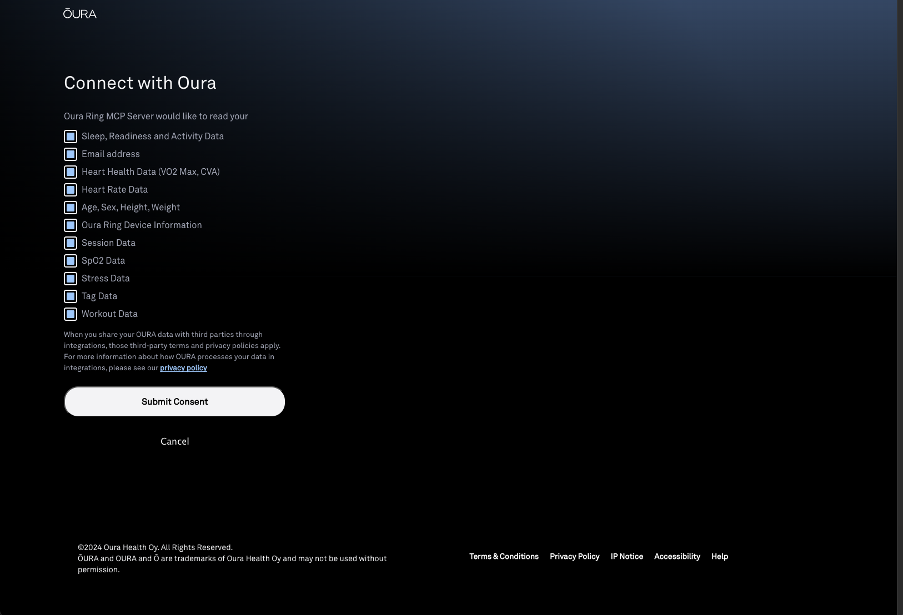
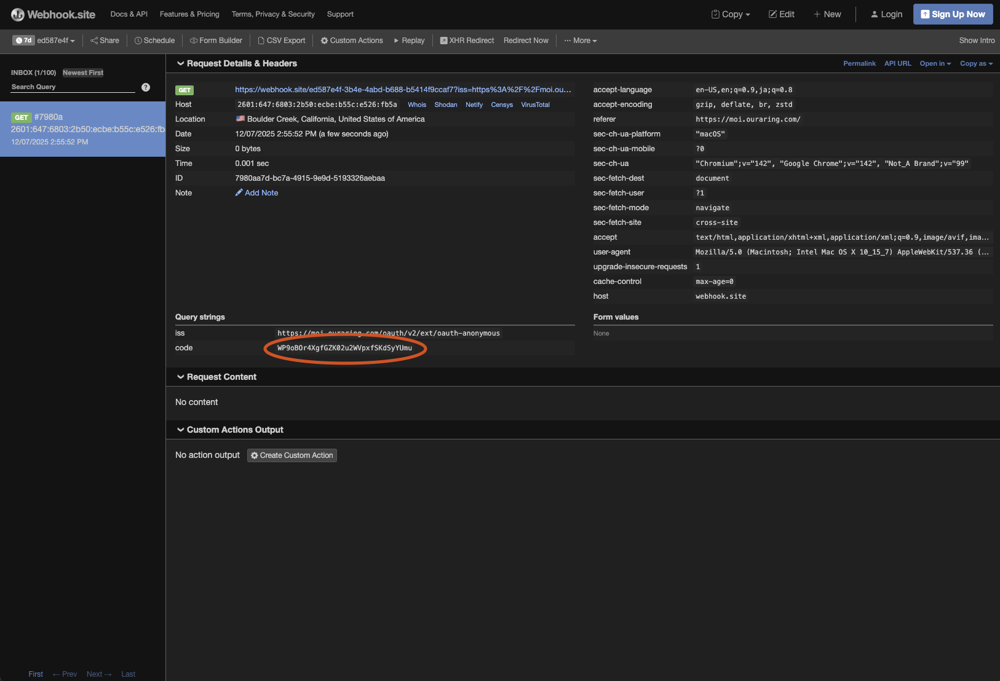

> NOTE: This project has been updated to use OAuth2 ahead of Oura Ring's deprecation of Personal Access Tokens (PATs). Because of that, this MCP will work for you into 2026 (and beyond) after following the setup steps.

# Oura Ring MCP Server

This repository contains a Model Context Protocol (MCP) implementation wrapping calls to the Oura Ring API. It can be used by any LLM that implements the MCP client protocol in order to interface with it. It's currently setup to run locally.

## Table of Contents

- [Setup](#setup)

  - [Oura Ring Application Setup](#oura-ring-application-setup)
  - [Server Setup](#server-setup)
  - [Claude Desktop Setup](#claude-desktop-setup)

- [Oura Ring API Overview](#oura-ring-api-overview)
- [Built With](#built-with)
- [Resources](#resources)

## Setup

### Oura Ring Application Setup

You'll have to jump through a few hooks initially to authorize this server as an "app" with Oura Ring as well as to have access to your account, but it should be smooth sailing after initial setup.

This server doesn't have a front-end by design (as your AI model - using something like Claude Desktop - will be the puppeteer after setup), so a few of the initial steps that would normally be a flow in a web/mobile app will be manual.

First, go to the [Oura Ring Developer Applications Dashboard](https://developer.ouraring.com/applications) and sign up your new MCP server application. You should "Add New" and fill it out like this:



For the above picture, there's a field for "Redirect URIs" which is a webhook callback URL. Unless you run a webhook service of your own, you can use [Webhook.site](https://webhook.site) for a quick test link. Copy the "Your unique URL" from the below screenshot into the "Redirect URIs" in the above screenshot on the Oura Ring new application dashboard:



Don't close the `webhook.site` url tab down yet.

Next, click "Create Application" for the Oura Ring new application flow. You'll then see the dashboard list your `Client id` and `Client secret`. Copy those into your local `.env` (using the `.env.example` file I included in this repository) for the `OURA_RING_CLIENT_ID` and `OURA_RING_CLIENT_SECRET` values.

Then, copy the `Example Authorization Url` from the Oura Ring Application Dashboard and open it in a tab in your browser. You'll be doing the OAuth2 flow manually to get your token. Approve all permissions with the "Submit Consent" button:



After you do that, the `webhook.site` dashboard will update with a callback that just got made to their service. Grab the `code` from that (below is a non-functional example token) and set it as the `OURA_RING_USER_CODE` value:



Congratulations, you now have all the secrets setup you need locally to proceed with using the MCP server. The actual access/refresh token fetch is automatic when you're using the MCP server.

> NOTE: If the `tokens.json` file - which stores your tokens locally and is _not_ checked into Git - gets deleted, you'll need to do this setup again. Oura Ring made it so that you can only get a `refresh_token` and `access_token` set from a user's code token once. Thereafter, you can only fetch new `access_token`s with the `refresh_token`. If you lose the `refresh_token`, it's game over and you'll have to do this setup again.

### Server Setup

First, you'll need to ensure that you have `uv` and the right Python versions.

Run these commands (assuming you don't already have them installed):

```sh
# Install uv
curl -LsSf https://astral.sh/uv/install.sh | sh
uv --version

# First, install pyenv
brew update
brew install pyenv
curl https://pyenv.run | bash

# Then, add these to your shell
export PATH="$HOME/.pyenv/bin:$PATH"
eval "$(pyenv init -)"
eval "$(pyenv virtualenv-init -)"

# Restart your shell using one of these commands
source ~/.zshrc
source ~/.bashrc

# Install Python 3.14.0 in Pyenv and set it as global
pyenv install 3.14.0
pyenv global 3.14.0

# Finally, verify via these commands
python --version
pyenv version
```

Next, you'll need to setup the environment for this repository and install dependencies. You can do that with this command (assuming you already completed the above Python version and `uv` install process) as `uv` automatically manages the virtual environment:

```sh
# Synchronize dependencies inside an automatic virtual environment
make sync
```

Finally, you can run the project with the following command:

```sh
make run
```

### Claude Desktop Setup

This MCP server is currently setup to be run/accessed by a model locally (on your local computer with something like [Claude Desktop](https://claude.com/download)). You can follow the [Anthropic local MCP server](https://modelcontextprotocol.io/docs/develop/connect-local-servers) setup options to run it locally. It will integrate with any LLM that has MCP client wrappers setup.

In order to use this MCP server, you will need to register with the Oura Ring developer portal and get your own keys to plug into a `.env` file (copied over from the `.env.example`). See earlier steps in this `README` file for that.

If you're using [Claude Desktop](https://claude.com/download), you can easily set up the connection to this repo (after adding the appropriate environment variables to your `.env` file) by [following this guide](https://modelcontextprotocol.io/docs/develop/connect-local-servers). For brevity, here's a snippet you can add to your `claude_desktop_config.json` file that will work for this repository:

```json
{
  "mcpServers": {
    "oura-ring": {
      "command": "/Users/<your username here>/.local/bin/uv",
      "args": [
        "--directory",
        "/Users/<your username here>/<path to repository here>/oura-ring-mcp-server",
        "run",
        "main.py"
      ]
    }
  }
}
```

This MCP server will work with other agents, but you will need to figure out the connections. Any setup following the MCP client protocol should be able to utilize it.

## Oura Ring API Overview

Different data has different sync policies for different types of data they collect:

- Sleep data only syncs when users open the app
- Daily activity and stress sync in the background without using the app

This can explain any descrepencies you see when your LLM tries to fetch most recent data. You might not have the most recent sleep data available until you (as a human) open up your Oura Ring app next.\

More information can be found in the [Oura Ring API Documentation](https://cloud.ouraring.com/v2/docs), particularly the section on [core concepts](https://cloud.ouraring.com/v2/docs#section/Core-Concepts)).

## Built With

- [MCP Python SDK](https://github.com/modelcontextprotocol/python-sdk)
- [Pydantic](https://docs.pydantic.dev/latest/)
- [Pytest](https://docs.pytest.org/en/stable/)
- [uv](https://github.com/astral-sh/uv)

## Resources

- [Model Context Protocol overview](https://modelcontextprotocol.io/docs/getting-started/intro), [architecture concepts](https://modelcontextprotocol.io/docs/learn/architecture), and [MCP server concepts](https://modelcontextprotocol.io/docs/learn/server-concepts)
- [Model Context Protocol Github repository](https://github.com/modelcontextprotocol) and [Python SDK](https://github.com/modelcontextprotocol/python-sdk/tree/main)
- [Oura Ring API Documentation](https://cloud.ouraring.com/v2/docs)
